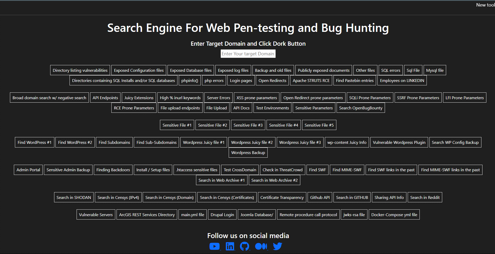

# Search Engine For Web Pen-testing and Bug Hunting
### Google dorks helper Website

```
https://0xpoyel.github.io/Search-Engine-For-Web-Pen-testing-and-Bug-Hunting/
```



---

## Connect with me

[](https://www.linkedin.com/in/zabed-ullah-poyel/)
[](https://medium.com/@zabedullahpoyel)
[](https://www.youtube.com/@0xPoyel)
[](https://x.com/zabedullahpoyel)
[](https://zabedullahpoyel.com)
[](mailto:zabedullahpoyelcontact@gmail.com)

---

### Directory listing vulnerabilities

```
site:example.com intitle:index.of
```

### Exposed Configuration files

```
site:example.com ext:xml | ext:conf | ext:cnf | ext:reg | ext:inf | ext:rdp | ext:cfg | ext:txt | ext:ora | ext:ini | ext:env
```

### Exposed Database files

```
site:example.com ext:sql | ext:dbf | ext:mdb
```

### Exposed log files

```
site:example.com ext:log
```

### Backup and old files

```
site:example.com ext:bkf | ext:bkp | ext:bak | ext:old | ext:backup
```

### Publicly exposed documents

```
site:example.com ext:doc | ext:docx | ext:odt | ext:pdf | ext:rtf | ext:sxw | ext:psw | ext:ppt | ext:pptx | ext:pps | ext:csv ext:txt | ext:xml | ext:xls | ext:xlsx intext:“confidential” | intext:“Not for Public Release” | intext:”internal use only” | intext:“do not distribute”
```

### Other files

```
site:example.com intitle:index.of | ext:log | ext:php intitle:phpinfo "published by the PHP Group" | inurl:shell | inurl:backdoor | inurl:wso | inurl:cmd | shadow | passwd | boot.ini | inurl:backdoor | inurl:readme | inurl:license | inurl:install | inurl:setup | inurl:config | inurl:"/phpinfo.php" | inurl:".htaccess" | ext:swf
```

### SQL errors

```
site:example.com intext:"sql syntax near" | intext:"syntax error has occurred" | intext:"incorrect syntax near" | intext:"unexpected end of SQL command" | intext:"Warning: mysql_connect()" | intext:"Warning: mysql_query()" | intext:"Warning: pg_connect()"
```

### Sql File

```
site:example.com inurl:"php?sql=select" ext:php
```

### Mysql file

```
site:example.com intitle:index.of conf.mysql
```

### Directories containing SQL Installs and/or SQL databases

```
site:example.com "sql" "parent" intitle:index.of -injection
```

### phpinfo()

```
site:example.com ext:php inurl:? intitle:phpinfo "published by the PHP Group"
```

### php errors

```
site:example.com "PHP Parse error" | "PHP Warning" | "PHP Error"
```

### Login pages

```
site:example.com inurl:login | inurl:signin | intitle:login | intitle:signin | inurl:signup | inurl:register | intitle:Signup | inurl:secure
```

### Open Redirects

```
site:example.com inurl:redir | inurl:url | inurl:redirect | inurl:return | inurl:src=http | inurl:r=http
```

### Apache STRUTS RCE

```
site:example.com ext:action | ext:struts | ext:do
```

### Find Pastebin entries

```
site:pastebin.com example.com
```

### Employees on LINKEDIN

```
site:linkedin.com employees example.com
```

### Broad domain search w/ negative search

```
site:example.com -www -shop -share -ir -mfa
```

### API Endpoints

```
site:example.com inurl:api | site:*/rest | site:*/v1 | site:*/v2 | site:*/v3
```

### Juicy Extensions

```
site:example.com ext:log | ext:txt | ext:conf | ext:cnf | ext:ini | ext:env | ext:sh | ext:bak | ext:backup | ext:swp | ext:old | ext:~ | ext:git | ext:svn | ext:htpasswd | ext:htaccess | ext:json
```

### High % inurl keywords

```
inurl:conf | inurl:env | inurl:cgi | inurl:bin | inurl:etc | inurl:root | inurl:sql | inurl:backup | inurl:admin | inurl:php site:example.com
```

### Server Errors

```
inurl:"error" | intitle:"exception" | intitle:"failure" | intitle:"server at" | inurl:exception | "database error" | "SQL syntax" | "undefined index" | "unhandled exception" | "stack trace" site:example.com
```

### XSS prone parameters

```
inurl:q= | inurl:s= | inurl:search= | inurl:query= | inurl:keyword= | inurl:lang= inurl:& site:example.com
```

### Open Redirect prone parameters

```
inurl:url= | inurl:return= | inurl:next= | inurl:redirect= | inurl:redir= | inurl:ret= | inurl:r2= | inurl:page= inurl:& inurl:http site:example.com
```

### SQLi Prone Parameters

```
inurl:id= | inurl:pid= | inurl:category= | inurl:cat= | inurl:action= | inurl:sid= | inurl:dir= inurl:& site:example.com
```

### SSRF Prone Parameters

```
inurl:http | inurl:url= | inurl:path= | inurl:dest= | inurl:html= | inurl:data= | inurl:domain=  | inurl:page= inurl:& site:example.com
```

### LFI Prone Parameters

```
inurl:include | inurl:dir | inurl:detail= | inurl:file= | inurl:folder= | inurl:inc= | inurl:locate= | inurl:doc= | inurl:conf= inurl:& site:example.com
```

### RCE Prone Parameters

```
inurl:cmd | inurl:exec= | inurl:query= | inurl:code= | inurl:do= | inurl:run= | inurl:read=  | inurl:ping= inurl:& site:example.com
```

### File upload endpoints

```
site:example.com ”choose file”
```

### File Upload

```
site:example.com inurl:uploadimage.php
```

### API Docs

```
inurl:apidocs | inurl:api-docs | inurl:swagger | inurl:api-explorer site:example.com
```

### Test Environments

```
inurl:test | inurl:env | inurl:dev | inurl:staging | inurl:sandbox | inurl:debug | inurl:temp | inurl:internal | inurl:demo site:example.com
```

### Sensitive Parameters

```
inurl:email= | inurl:phone= | inurl:password= | inurl:secret= inurl:& site:example.com
```

### Sensitive File #1

```
site:example.com intext:pom.xml intitle:"index of /"
```

### Sensitive File #2

```
site:example.com intext:"Index of" intext:"/etc"
```

### Sensitive File #3

```
site:example.com intitle:"index of" "users.yml" | "admin.yml" | "config.yml"
```

### Sensitive File #4

```
site:example.com intitle:"index of" "download.php?file="
```

### Sensitive File #5

```
site:example.com intitle:index.of conf.php
```

### Find WordPress #1

```
site:example.com inurl:wp- | inurl:wp-content | inurl:plugins | inurl:uploads | inurl:themes | inurl:download | inurl:wp-includes
```

### Find WordPress #2

```
inurl:wp-content | inurl:wp-includes example.com
```

### Find Subdomains

```
site:*.example.com
```

### Find Sub-Subdomains

```
site:*.*.example.com
```

### Wordpress Juicy file #1

```
site:example.com inurl:/wp-content/uploads/wpo_wcpdf
```

### Wordpress Juicy file #2

```
site:example.com inurl:wp-content/uploads/wcpa_uploads
```

### Wordpress Juicy file #3

```
site:example.com inurl:"wp-content" intitle:"index.of" intext:wp-config.php
```

### wp-content Juicy Info

```
site:example.com inurl:/wp-content/uploads/wpo_wcpdf
```

### Vulnerable Wordpress Plugin

```
site:example.com inurl:*/wp-content/plugins/contact-form-7/
```

### Wordpress Backup

```
site:example.com inurl:"wp-content" intitle:"index.of" intext:backup"
```

### Admin Portal

```
site:example.com inurl:/admin.aspx
```

### Sensitive Admin Backup

```
site:example.com intitle:"Index of" inurl:/backup/ "admin.zip"
```

### Finding Backdoors

```
site:example.com inurl:shell | inurl:backdoor | inurl:wso | inurl:cmd | shadow | passwd | boot.ini | inurl:backdoor
```

### Install / Setup files

```
site:example.com inurl:readme | inurl:license | inurl:install | inurl:setup | inurl:config
```

### .htaccess sensitive files

```
inurl:"/phpinfo.php" | inurl:".htaccess" | inurl:"/.git" example.com -github
```

### Test CrossDomain

```
example.com/crossdomain.xml
```

### Check in ThreatCrowd

```
threatcrowd.org/domain.php?domain=example.com
```

### Find SWF

```
+inurl:example.com +ext:swf
```

### Find MIME-SWF

```
site:example.com mime:swf
https://yandex.com/search/?text=
```

### Find SWF links in the past

```
https://web.archive.org/cdx/search?url= + /&matchType=domain&collapse=urlkey&output=text&fl=original&filter=urlkey:.*swf&limit=100000&_=1507209148310
```

### Find MIME-SWF links in the past

```
https://web.archive.org/cdx/search?url= + /&matchType=domain&collapse=urlkey&output=text&fl=original&filter=mimetype:application/x-shockwave-flash&limit=100000&_=1507209148310
```

### Search in Web Archive #1

```
https://web.archive.org/web/*/(.
```

### Search in Web Archive #2

```
https://web.archive.org/web/*/
```

### Search in SHODAN

```
https://www.shodan.io/search?query=example.com
```

### Search in Censys (IPv4)

```
https://censys.io/ipv4?q=example.com
```

### Search in Censys (Domain)

```
https://search.censys.io/domain?q=example.com
```

### Search in Censys (Certificates)

```
https://search.censys.io/certificates?q=example.com
```

### Certificate Transparency

```
https://crt.sh/?q=%25.example.com
```

### Github API

```
site:example.com intitle:"index of" github-api
```

### Search in GITHUB

```
https://github.com/search?q=%22*.example.com%22&type=host
```

### Sharing API Info

```
site:example.com intitle:"Sharing API Info"
```

### Search in Reddit

```
https://www.reddit.com/search/?q=example.com&source=recent&rdt=55538
```

### Vulnerable Servers

```
site:example.com inurl:"/geoserver/ows?service=wfs"
```

### ArcGIS REST Services Directory

```
site:example.com intext:"ArcGIS REST Services Directory" intitle:"Folder: /"
```

### main.yml file

```
site:example.com intitle:"index of "main.yml"
```

### Drupal Login

```
site:example.com inurl:user intitle:"Drupal" intext:"Log in" -"powered by"
```

### Joomla Database

```
site:example.com inurl: /libraries/joomla/database/
```

### Remote procedure call protocol

```
site:example.com intext:"index of" inurl:json-rpc
```

### jwks-rsa file

```
site:example.com intext:"index of" inurl:jwks-rsa
```

### Docker-Compose yml file

```
site:example.com intitle:"index of" "docker-compose.yml"
```

### Google Groups

```
site:groups.google.com "example.com"
```

### Code Leaks

```
site:pastebin.com "example.com"
```

```
site:jsfiddle.net "example.com"
```

```
site:codebeautify.org "example.com"
```

```
site:codepen.io "example.com"
```

### Cloud Storage

```
site:s3.amazonaws.com "example.com"
```

```
site:blob.core.windows.net "example.com"
```

```
site:googleapis.com "example.com"
```

```
site:drive.google.com "example.com"
```

```
site:dev.azure.com "example[.]com"
```

```
site:onedrive.live.com "example[.]com"
```

```
site:digitaloceanspaces.com "example[.]com"
```

```
site:sharepoint.com "example[.]com"
```

```
site:s3-external-1.amazonaws.com "example[.]com"
```

```
site:s3.dualstack.us-east-1.amazonaws.com "example[.]com"
```

```
site:dropbox.com/s "example[.]com"
```

```
site:box.com/s "example[.]com"
```

```
site:docs.google.com inurl:"/d/" "example[.]com"
```

### JFrog Artifactory

```
site:jfrog.io "example[.]com"
```

### Firebase

```
site:firebaseio.com "example[.]com"
```

### Bug Bounty programs and Vulnerability Disclosure Programs <!--omit-->

```
"submit vulnerability report" | "powered by bugcrowd" | "powered by hackerone"
```

```
site:*/security.txt "bounty"
```
